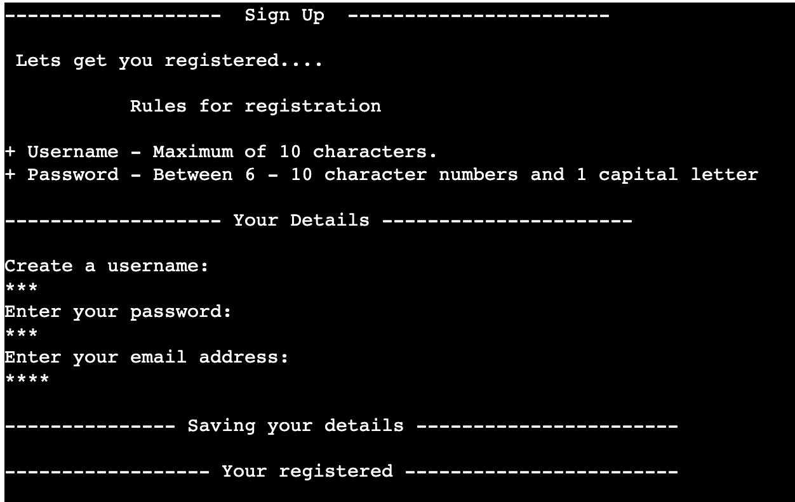

# Rock Paper & Sissors  

### Developer: Asma Aamir 

## About
A traditional game that I played with my sibling to decide who would watch Tv first. Here, I've created it for computer play with user. Where the user make a choice to choose from Rock, Paper and Sissors. The computer makes the decison simultaneously. Who wins will depned on the choices they make. You must make an effort to forsee you adversary's futuer action if you to outwit them. 

## Table of Content
1. [Project Goals](#projects-goals)
    1. [User Goals](#user-goals)
    2. [Site Owner Goals](#site-owner-goals)
2. [User Experience](#user-experiencer)
    1. [Target Audience](#target-audience)
    2. [User Requrements and Expectations](#users-requirment-and-expectations)
    3. [User manual]()
3. [Technical Design](#technical-design)
    1. 
4. [Technologies Used](#technologies-used)
    1. [Languages](#languages)
    2. [Frameworks & Tools](#frameworks--tools)
    3. [Libraries](#libraries)
5. [Features](#features)
6. [Testing](#validation) 
8. [Bugs](#bugs)
9. [Deployment](#deployment)
10. [Credits](#credits)
11. [Acknowledgements](#acknowledgements)

# Projects Goals
### User Goals:
* Paly a simple, enjoable gam
* Having access to your existing account 
* Before playing the game, read the rules.

### Site Owner Goals:
* Make a game that is simple and intuitive to play.
* Make sure that players comprehend the game's goal.

## User Experience 
### Target Audience
The game's doesn't have a target audience. However, in accordance with the traditional game, I would advise that participants be at least 4 year & above and be computer literate.  

### User Requirements and Expectations

### User Manual

### Home Page

On the home page users are first shown a welcome page, with header ROCK, PAPER & SISSORS running diaginally. The user can choose from a few option below the welcome and header. Operation: Enter the entry key after entering a numeric value. 

- Game rules 
- log in 
- Play game   

If a player enters a number that does not match an option that is accessible at any time during the game, they will be prompted to try again. 

### Game Rules

User can read a brief description of the game rules by selecting the first option to examine the game rules, after which they can return to the main menu or login page, simply by chossing the option. 

### Play 

The Play Game option prompts users to indicate whether they have already played the game or not. If they have, they will be directed to the login page; if not they will be directed to the registration page. 

### Log in 

User are prompted to providde thie perivous login detail when chossing option 1. 
There is a validation mechamismm used for the username and password. The user has the choice to try again or register if they enter a username or password that havn't been registered. Operation: Press the enter key after entering a numeric value:
- Try again 
- Register  

Until the username and password entered by the user match the one that had already been registered, they can try again. If it does, then they would be greeted with a message. 
Alternativly, they can register by choosing the second choice.  

### Registration for new players

Users can register to creat a new user by choosing the option from the login menu. 
The user will be prompted for their username and password in that order. The validation process involves both values. 
- Username must only contaon the leters a-z and can be no longer then 10 characters. 
- Password can be anywhere from 6 to 10 charaters. It can also inculde a capital letter and the digits 0-9.  

once registration is complete, the user is greeted with a notice that they have successfully registered and gives the choice to play or go the home page. 

### Game and Plat again

The user makes the first move by selecting rock, paper or sissors by typing it on the keybaord. Then computer makes its move and the game's outcome is displayed to the user. 
If the users enter anthying other then rock ,paper and sissord  in the consol, the application will keep presenting the same option. 
When the user wins, lose or ties a notice stating that they can play agian will appear. If they select yes the game will restart. if not, it offers the user below optiom:
- Play again 
- Home page 
- Quit 

### Quit game 

The application display a goodbye message whne the user exits. 

## User Stories
### Users
* 
* 
* 

### Site Owner
* 
* 
* 

## Technical Design 
* Flowchart 

The application's structure and logic are summarised in th diagram below. 

Flowchart

## Technologies Used
* Language
    - The logic of the programme was created using the Python programming language. 
* Frameworks & Tools 
    - Git Pod
    - GitHub
    - Google Cloud Platform
    - Google Sheets 
    - Heroku Platform 
    - Diagrams.net 
* Libraries
    * Python Libararies: 
        - Random: Used in Rock Paper & Scissors game to the user can play againt the computer. 
    * Third Party Libraries:
        - gspread: 
        
## Features
1. Main Menu
The page's primary message welcomes you and displays the game of Rock, Paper, and Scissors diagonally. Subheading "Main Menu" with three choices follows:
* Game rules
* Login 
* Exist 

Main Menu 

2. Game Rules 
    The Game rules option cover the rule on how to play the game, who you will be playing the game with. Also how you can win the game. 
    

Game Rules 

    

3. Log-in 
    The application asks you if you've played before when you select the login option. There are 3 choices.
    * Yes - Takes you to your login page, welcomes you with a message, and then requests your username and password. You can play the game if your registration information is accurate.
    * No - Takes you to registration page.
    * Home Page - Take you back to home page. 
    

Log In 

    

4. Register 
    When you go to the registration page, you can see the registration regulations and the sign up subheading. You will then be prompted by the application to enter your username, password, and email address. If everything is OK, you will be greeted with a notice that says "storing your details" and "your registered."
    

Registration 

    

5. Game and Play again  
    Following registration or logging in, we can play the game. The subheading "Let's start" is the first thing you see, followed by your three options: "rock," "paper," or "scissors." When you write what you want, the machine makes a choice, and you immediately receive the outcome. letting you know if there was a tie, a win, or a loss. You then have the option to play again.
    

Game & Play again 

    

6. Quit game
    once you select the opion to exist the game your are greet with message saying 'thank you for play' and 'have a lovley day'. 
    

Exist 

    

    
## Validation

## Testing 

## Bugs

## Deployment
### Heroku 

I used Heroky to deploye this application through GitGub. below are the step I took to deploye the appliction:

1. Create an account on herkou.com or sign in. 
2. Creat a new app, add your project name and choose your region then click creat app.  
3. Go to Setting and go to Config Vars - there you can put any files that is sensitive e.g (CREDS.json)
4. Then we need to add buildpacks, so click on Add build pack and choose python first and the nodejs. They have to in that order
5. Go to Deploy and at the Deplument method, click on Connect with Github. 
6. Then it will ask you to enter your repository name and once you find it click on it. 
7. Once connect it will ask you to choose the branch you want yo build you app from.
8. To make thing easy for you click Enable auTOMATIC deploys, this will keep the app up to date with your Github repository. 

### Forking the GitHub Repository

You can create a copy of the original repository to see or edit with out changing the original by forking on GitHub. You can do this by following these steps:

1. Log in to your GitHub account and search for the repository.
2. Click on Fork (its the last button on the top right of the repository page.)
3. Thus copy the repository in to your GitHub account.

### Making a Local Clone

1. Log in to your GitHub account and find the repositroy taht your would like to clone
2. Then locate the Code button (It's the 3rd button on the right befor the GitPod button).
3. You will need to copy the HTTPS link and then open Git Bash. 
4. You would need to change the curent working directory to where you want the cloned directory to be made.
5. Then in the IDE'S terminal type 'git clone' then paste the URL link that you copied from HTTPS.
6. After pressing enter, that would have created your local clone.  

## Credits 

* Code Institute - for Git template ide and "Love Sandwiches - Essentials Project" which helped me with connecting the Google Spreadsheet to my project.

## Acknowledgements 

I would like to take this opportunit to thank you :
* My mentor Mo Shami for his feedback , advise and guidance
* tutor Ger for helping me fix registeration issue
* My mum Farida Liaqat for looking after my daughter and my daughter Zainab Rana for being very patient with me. 